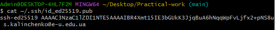
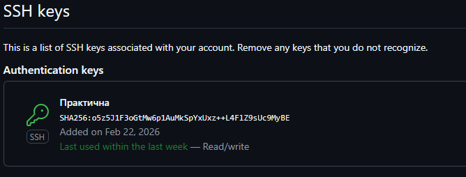
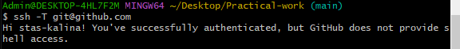

# Practical work
Практична робота з курсу "Cистемний аналіз та проектування інформаційних систем 25/26 - s2 (241)"

Виконавець: Калінченко Станіслав Сергійович, група КН-231, Черкаська філія
Дата: лютий 2026 року

Мета роботи
- Встановити Git
- Створити публічний репозиторій
- Налаштувати SSH-ключ
- Додати скріншоти підтвердження

Виконані кроки

1. Створено репозиторій Practical-work
2. Встановлено Git 2.53.0
3. Згенеровано SSH-ключ (Ed25519)
4. Додано ключ у GitHub ? Settings ? SSH and GPG keys
5. Перевірено підключення: `ssh -T git@github.com`

Підтвердження налаштування SSH

Ось скріншоти виконаної роботи:

1. Згенерований публічний ключ  
   

2. Доданий ключ у налаштуваннях GitHub  
   

3. Успішна автентифікація  
   

Скріншоти

<image-card alt="Вивід публічного ключа" src="ssh-keygen_output.png" ></image-card>
<image-card alt="Список ключів у GitHub" src="github_ssh_keys_list.png" ></image-card>
<image-card alt="Успішна автентифікація" src="ssh_test_success.png" ></image-card>

## Додані розділи

- [Збір та аналіз вимог](Practical_work_IS_Збір_та_аналіз_вимог.docx)
- [Користувачі](Practical_work_IS_Користувачі.docx)
