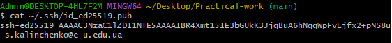
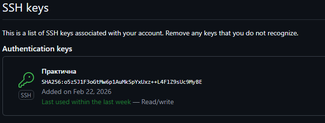
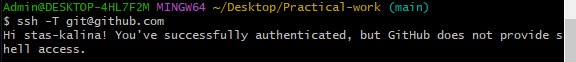

# Practical work

Практична робота з курсу "Cистемний аналіз та проектування інформаційних систем 25/26 - s2 (241)"

Виконавець: Калінченко Станіслав Сергійович, група КН-231, Черкаська філія

Дата: лютий 2026 року

Мета роботи

- Встановити Git

- Створити публічний репозиторій

- Налаштувати SSH-ключ

- Додати скріншоти підтвердження

Виконані кроки

1. Створено репозиторій Practical-work

2. Встановлено Git 2.53.0

3. Згенеровано SSH-ключ (Ed25519)

4. Додано ключ у GitHub ? Settings ? SSH and GPG keys

5. Перевірено підключення: `ssh -T git@github.com`

Підтвердження налаштування SSH

Ось скріншоти виконаної роботи:

1. Згенерований публічний ключ  

   

2. Доданий ключ у налаштуваннях GitHub  

   

3. Успішна автентифікація  

   

Скріншоти

<image-card alt="Вивід публічного ключа" src="ssh-keygen_output.png" ></image-card>

<image-card alt="Список ключів у GitHub" src="github_ssh_keys_list.png" ></image-card>

<image-card alt="Успішна автентифікація" src="ssh_test_success.png" ></image-card>

## Додані розділи

- [Збір та аналіз вимог](Practical_work_IS_Збір_та_аналіз_вимог.docx)

- [Користувачі](Practical_work_IS_Користувачі.docx)

## 10 функціональних сценаріїв (User Stories)

1. [User Story 1: Запис пацієнта онлайн](User_Story_1_Запис_пацієнта_онлайн.docx)  

2. [User Story 2: Реєстрація пацієнта через особистий кабінет](User_Story_2_Реєстрація_пацієнта_через_особистий_кабінет.docx)  

3. [User Story 3: Отримання нагадувань пацієнтом](User_Story_3_Отримання_нагадувань_пацієнтом.docx)  

4. [User Story 4: Перегляд медичної історії пацієнтом](User_Story_4_Перегляд_медичної_історії_пацієнтом.docx)  

5. [User Story 5: Швидкий перегляд карти пацієнта](User_Story_5_Швидкий_перегляд_карти_пацієнта.docx)  

6. [User Story 6: Рекомендації AI для лікаря](User_Story_6_Рекомендації_AI_для_лікаря.docx)  

7. [User Story 7: Пошук пацієнта адміністратором](User_Story_7_Пошук_пацієнта_адміністратором.docx)  

8. [User Story 8: Дашборд для адміністратора](User_Story_8_Дашбоард_для_Адміністратора.docx)  

9. [User Story 9: Автоматична генерація рахунку для касира](User_Story_9_Автоматична_генерація_рахунку_для_касира.docx)  

10. [User Story 10: Автоматичні алерти IT-спеціаліст](User_Story_10_Автоматичні_алерти_IT_спеціаліст.docx)

## Додані документи

- [Модель даних](Practical_work_IS_Модель_даних.docx)  
  Опис сутностей, ER-діаграма, атрибути, зв’язки між таблицями

- [Архітектура системи](Practical_work_IS_Архітектура_системи.docx)  
  Компонентна діаграма, шари системи, обрані технології, розгортання

## Додані документи (оновлення)

- [Масштабування системи](Practical_work_IS_Масштабування_системи.docx)  
  Аналіз можливостей горизонтального та вертикального масштабування, метрики, інструменти (Kubernetes, HPA, sharding)

- [Обґрунтування вибору бази даних](Practical_work_IS_Обгрунтування_вибору_бази_даних.docx)  
  Порівняння PostgreSQL, MongoDB, Redis; обґрунтування гібридного підходу

- [Аналіз системи безпеки](Practical_work_IS_Аналіз_системи_безпеки.docx)  
  Багаторівневий захист, автентифікація, шифрування, відповідність GDPR/HIPAA

- [Перспективи розвитку системи](Practical_work_IS_Перспективи_розвитку_системи.docx)  
  Телемедицина, AI-діагностика, multi-region, персоналізована медицина

- [Вибір методології розробки](Practical_work_IS_Вибір_методології_розробки.docx)  
  Гібридний підхід: Scrum + DevOps + елементи Kanban

- [Документування результатів проєкту](Practical_work_IS_Документування_результатів_проєкту.docx)  
  Повний набір документів, структура, версійність, доступність

- [Цикли в системі](Practical_work_IS_Цикли_в_системі.docx)  
  Позитивні та негативні цикли зворотного зв’язку (пацієнти, масштабування, безпека)

- [Артефакт системи](Practical_work_IS_Артефакт_системи.docx)  
  Програмний продукт, інформаційна система, архітектурний артефакт (IEEE 42010)

- [Точки впливу на систему](Practical_work_IS_Точки_впливу_на_систему.docx)  
  Leverage points за Донеллою Медоуз (парадигма, правила, інформаційні потоки)
